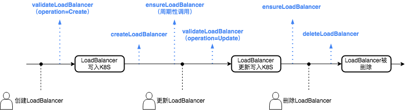
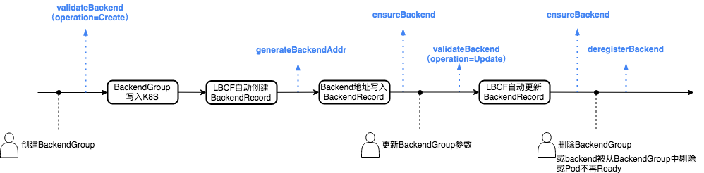

<!-- TOC -->

- [webhook列表](#webhook列表)
- [webhook的调用](#webhook的调用)
- [webhook的重试策略](#webhook的重试策略)
- [Webhook定义](#webhook定义)
    - [validateLoadBalancer](#validateloadbalancer)
    - [createLoadBalancer](#createloadbalancer)
    - [ensureLoadBalancer](#ensureloadbalancer)
    - [deleteLoadBalancer](#deleteloadbalancer)
    - [validateBackend](#validatebackend)
    - [generateBackendAddr](#generatebackendaddr)
    - [ensureBackend](#ensurebackend)
    - [deregisterBackend](#deregisterbackend)

<!-- /TOC -->

## webhook列表
本规范定义了Webhook server**必须实现**的8个webhook，其中4种用来操作负载均衡实例，另外4种用来操作被绑定的backend。

| Webhook | 操作对象 | 功能 |
|:---|:---:|:---|
|validateLoadBalancer|LB|验证提交至K8S的LoadBalancer参数的合法性。在创建与更新时都会被调用，可以用来拒绝用户的创建/更新操作|
|createLoadBalancer|LB|创建负载均衡实例|
|ensureLoadBalancer|LB|更新负载均衡实例的配置，有一次性调用与周期性调用两种调用方式|
|deleteLoadBalancer|LB|删除负载均衡实例|
|validateBackend|backend|验证提交至K8S的BackendGroup参数的合法性。在创建与更新时都会被调用，可以用来拒绝用户的创建/更新操作|
|generateBackendAddr|backend|生成绑定backend时使用的backend地址|
|ensureBackend|backend|绑定/更新backend，有一次性调用与周期性调用两种调用方式|
|deregisterBackend|backend|解绑backend|

## webhook的调用

**LB相关webhook**



**backend相关webhook**



## webhook的重试策略

Webhook server在实现上述webhook时无需在本地进行重试，所有重试都由LBCF根据webhook响应按照一定策略自动进行。

LBCF的重试策略分为以下几种：

1. 不重试
    * validateLoadBalancer
    * validateBackend
2. 失败后重试
    * createLoadBalancer
    * ensureLoadBalancer
    * deleteLoadBalancer
    * generateBackendAddr
    * ensureBackend
    * deregisterBackend
3. 周期性调用(需手动开启)
    * ensureLoadBalancer
    * ensureBackend
    
*注：周期性调用的开关仅影响webhook在成功调用后是否依旧被周期性调用，"失败后重试"中的所有webhook都会在失败后被无条件重试*

对于所有"不重试"的webhook，webhook响应中都包含下述统一字段

| Field | Type | Required | Description |
|:---|:---:|:---:|:---|
|succ|bool|TRUE|执行结果|
|msg|string|FALSE|succ为false时需要反馈给用户的信息|

对于所有"失败后重试"和"周期性调用"的webhook，请求与响应中都包含下述共同字段

**公共请求消息体**

| Field | Type | Description |
|:---|:---:|:---|
|recordID|string|任务ID.多次重试间保持不变|
|retryID|string|操作ID.发生重试时会改变|

**公共响应消息体**

| Field | Type | Required | Description |
|:---|:---:|:---:|:---|
|status|string|TRUE|执行结果。支持`Succ`，`Fail`，`Running`，其中`Running`用来实现异步操作|
|msg|string|FALSE|反馈给用户的信息|
|minRetryDelayinSeconds|string|FALSE|距离下次重试的最小间隔。实际重试间隔受LBCF控制，可能大于此值|

## Webhook定义

### validateLoadBalancer

```
Method: POST
Content-Type: application/json
Path: /validateLoadBalancer
```

**请求**

| Field | Type | Description |
|:---|:---:|:---|
|lbSpec|map<string,string>|来自[LoadBalancer](lbcf-crd.md#loadbalancer).spec.lbSpec|
|operation|string|调用原因，可能的值为`Create`，`Update`。其中`Create`表示本次调用发生在用户创建[LoadBalancer](lbcf-crd.md#loadbalancer)对象时，`Update`表示发生在用户更新[LoadBalancer](lbcf-crd.md#loadbalancer)对象时。|
|attributes|map<string,string>|来自[LoadBalancer](lbcf-crd.md#loadbalancer).spec.attributes|
|oldAttributes|map<string,string>|更新前的attributes。**仅当operation为Update时有效**|

**响应**

| Field | Type | Required | Description |
|:---|:---:|:---:|:---|
|succ|bool|TRUE|执行结果|
|msg|string|FALSE|succ为false时需要反馈给用户的信息|

**样例请求1：用户创建LoadBalancer时被调用**
```json
{
    "lbSpec": {
        "lbID": "lb-1234",
        "lblID": "lbl-2222",
        "domain": "example.com",
        "path": "/"
    },
    "operation": "Create",
    "attributes": {
        "chargeType": "TRAFFIC_POSTPAID_BY_HOUR",
        "max-bandwidth-out": "1"
    }
}
```

**样例请求2：用户更新LoadBalancer时被调用**

本例中，用户把上一示例中attributes的max-bandwidth-out由1修改为2
```json
{
    "lbSpec": {
        "lbID": "lb-1234",
        "lblID": "lbl-2222",
        "domain": "example.com",
        "path": "/"
    },
    "operation": "Update",
    "attributes": {
        "chargeType": "TRAFFIC_POSTPAID_BY_HOUR",
        "max-bandwidth-out": "2"
    },
    "oldAttributes": {
        "chargeType": "TRAFFIC_POSTPAID_BY_HOUR",
        "max-bandwidth-out": "1"
    }
}
```

### createLoadBalancer

```
Method: POST
Content-Type: application/json
Path: /createLoadBalancer
```

**请求**

| Field | Type | Description |
|:---|:---:|:---|
|recordID|string|任务ID.多次重试间保持不变|
|retryID|string|操作ID.发生重试时会改变|
|lbSpec|map<string,string>|来自[LoadBalancer](lbcf-crd.md#loadbalancer).spec.lbSpec|
|attributes|map<string,string>|来自[LoadBalancer](lbcf-crd.md#loadbalancer).spec.attributes|

**响应**

| Field | Type | Required | Description |
|:---|:---:|:---:|:---|
|status|string|TRUE|执行结果。支持`Succ`，`Fail`，`Running`，其中`Running`用来实现异步操作|
|msg|string|FALSE|反馈给用户的信息|
|minRetryDelayinSeconds|string|FALSE|距离下次重试的最小间隔。实际重试间隔受LBCF控制，可能大于此值|
|lbInfo|map<string,string>|FALSE|负载均衡的唯一标识。若为空，则使用lbSpec作为唯一标识|

**样例请求**

本例中，用户明确给出了lbID（负载均衡实例ID），但没有给出监听器ID，而是给出了监听器需要具备的属性
```json
{
    "recordID":"12345",
    "retryID":"1",
    "lbSpec": {
        "lbID": "lb-1234",
        "expectListenerPort": "80",
        "expectListenerProtocol": "HTTP"
    },
    "attributes": {
        "chargeType": "TRAFFIC_POSTPAID_BY_HOUR",
        "max-bandwidth-out": "1"
    }
}
```

**样例响应**

从响应中可见，Webhook server根据样例请求中的监听器属性创建了新的监听器，并使用listenrerID（监听器ID）与lbID的二元组作为负载均衡唯一标识
```json
{
    "status": "Succ",
    "lbInfo": {
        "lbID": "lb-1234",
        "listenerID": "lbl-2234"
    }
}
```

### ensureLoadBalancer

```
Method: POST
Content-Type: application/json
Path: /ensureLoadBalancer
```

**请求**

| Field | Type | Description |
|:---|:---:|:---|
|recordID|string|任务ID.多次重试间保持不变|
|retryID|string|操作ID.发生重试时会改变|
|lbInfo|map<string,string>|负载均衡的唯一标识,来自[LoadBalancer](lbcf-crd.md#loadbalancer).status.lbInfo|
|attributes|map<string,string>|来自[LoadBalancer](lbcf-crd.md#loadbalancer).spec.attributes|

**响应**

| Field | Type | Required | Description |
|:---|:---:|:---:|:---|
|status|string|TRUE|执行结果。支持`Succ`，`Fail`，`Running`，其中`Running`用来实现异步操作|
|msg|string|FALSE|反馈给用户的信息|
|minRetryDelayinSeconds|string|FALSE|距离下次重试的最小间隔。实际重试间隔受LBCF控制，可能大于此值|

**样例请求**

```json
{
    "recordID":"12345",
    "retryID":"1",
    "lbInfo": {
        "lbID": "lb-1234",
        "listenerID":"lbl-2234",
    },
    "attributes": {
        "chargeType": "TRAFFIC_POSTPAID_BY_HOUR",
        "max-bandwidth-out": "1"
    }
}
```

**样例响应**

```json
{
    "status": "Succ",
}
```

### deleteLoadBalancer

```
Method: POST
Content-Type: application/json
Path: /deleteLoadBalancer
```

**请求**

与[ensureLoadBalancer](#ensureloadbalancer)相同

**响应**

与[ensureLoadBalancer](#ensureloadbalancer)相同

### validateBackend

```
Method: POST
Content-Type: application/json
Path: /validateBackend
```

**请求**

| Field | Type | Description |
|:---|:---:|:---|
|backendType|string|Backend类型。可能的值为`Service`,`Pod`,`Static`，分别与[BackendGroup](lbcf-crd.md#backendgroup)中的三种配置一一对应|
|lbInfo|map<string,string>|负载均衡的唯一标识,来自[LoadBalancer](lbcf-crd.md#loadbalancer).status.lbInfo|
|operation|string|调用原因，可能的值为`Create`，`Update`。其中`Create`表示本次调用发生在用户创建[LoadBalancer](lbcf-crd.md#loadbalancer)对象时，`Update`表示发生在用户更新[LoadBalancer](lbcf-crd.md#loadbalancer)对象时。|
|parameters|map<string,string>|来自[BackendGroup](lbcf-crd.md#backendgroup).spec.parameters|
|oldParameters|map<string,string>|更新前的parameters。**仅当operation为Update时有效**|

**响应**

| Field | Type | Required | Description |
|:---|:---:|:---:|:---|
|succ|bool|TRUE|执行结果|
|msg|string|FALSE|succ为false时需要反馈给用户的信息|

**样例请求**
```json
{
    "backendType":"Pod",
    "lbInfo": {
        "lbID": "lb-1234",
        "lblID": "lbl-2222",
        "domain": "example.com",
        "path": "/"
    },
    "operation": "Create",
    "parameters": {
        "weight":"100"
    }
}
```

**样例响应**
```json
{
    "succ": true
}
```

### generateBackendAddr

```
Method: POST
Content-Type: application/json
Path: /generateBackendAddr
```

**请求**

| Field | Type | Description |
|:---|:---:|:---|
|recordID|string|任务ID.多次重试间保持不变|
|retryID|string|操作ID.发生重试时会改变|
|lbInfo|map<string,string>|负载均衡的唯一标识,来自[LoadBalancer](lbcf-crd.md#loadbalancer).status.lbInfo|
|lbAttributes|map<string,string>|来自[LoadBalancer](lbcf-crd.md#loadbalancer).spec.attributes|
|parameters|map<string,string>|来自[BackendGroup](lbcf-crd.md#backendgroup).spec.parameters|
|podBackend|PodBackend|Pod信息。**仅当[BackendGroup](lbcf-crd.md#backendgroup)类型为Pods时有效**|
|serviceBackend|ServiceBackend|service与node信息。**仅当[BackendGroup](lbcf-crd.md#backendgroup)类型为Service时有效**|

**PodBackend**

| Field | Type | Description |
|:---|:---:|:---|
|pod|[K8S.Pod](https://kubernetes.io/docs/concepts/workloads/pods/pod/)|完整的Pod对象（json格式）|
|port|PortSelector|需要绑定的容器内端口，来自[BackendGroup](lbcf-crd.md#backendgroup)中使用的PortSelector|

**ServiceBackend**

| Field | Type | Description |
|:---|:---:|:---|
|service|[K8S.Service](https://kubernetes.io/docs/concepts/services-networking/service/)|完整的Service对象（json格式）|
|port|PortSelector|需要被绑定的Service端口，来自[BackendGroup](lbcf-crd.md#backendgroup)中使用的PortSelector|
|nodeName|string|Node.name|
|nodeAddresses|[][Address](https://kubernetes.io/docs/concepts/architecture/nodes/#addresses)|Node地址|

**响应**

| Field | Type | Required | Description |
|:---|:---:|:---:|:---|
|status|string|TRUE|执行结果。支持`Succ`，`Fail`，`Running`，其中`Running`用来实现异步操作|
|msg|string|FALSE|反馈给用户的信息|
|minRetryDelayinSeconds|string|FALSE|距离下次重试的最小间隔。实际重试间隔受LBCF控制，可能大于此值|
|backendAddr|string|TRUE|被绑定至负载均衡的backend地址|

**样例请求1：生成绑定Pod所需地址**
```json
{
    "recordID":"12345",
    "retryID":"1",
    "lbInfo":{
        "lbID":"lb-1234",
        "listenerID":"lbl-2234"
    },
    "lbAttributes": {
        "chargeType": "TRAFFIC_POSTPAID_BY_HOUR",
        "max-bandwidth-out": "1"
    },
    "parameters":{
        "weight":"100"
    },
    "podBackend":{
        "pod":"{\"apiVersion\":\"tke.cloud.tencent.com/v1beta1\",\"kind\":\"Pod\"}...",
        "port":{
            "portNumber":80,
            "protocol":"TCP"
        }
    }
}
```

**样例2：生成绑定Service NodePort所需地址**
```json
{
    "recordID": "12345",
    "retryID": "1",
    "serviceBackend": {
        "service": "{\"apiVersion\":\"tke.cloud.tencent.com/v1beta1\",\"kind\":\"Service\"}...",
        "port": {
            "portNumber": 80,
            "protocol": "TCP"
        },
        "nodeName": "10.0.3.3",
        "nodeAddress": [
            {
                "address": "10.0.3.3",
                "type": "InternalIP"
            },
            {
                "address": "62.234.165.23",
                "type": "ExternalIP"
            },
            {
                "address": "10.0.3.3",
                "type": "Hostname"
            }
        ]
    }
}
```

### ensureBackend

```
Method: POST
Content-Type: application/json
Path: /ensureBackend
```

ensureBackend用来绑定backend，Webhook server在实现时**必须**遵守以下规范：
* 重复操作一个已成功的backend**必须**是成功的（否则操作将被无限重试）

**请求**

| Field | Type | Description |
|:---|:---:|:---|
|recordID|string|任务ID.多次重试间保持不变|
|retryID|string|操作ID.发生重试时会改变|
|lbInfo|map<string,string>|负载均衡的唯一标识,来自[LoadBalancer](lbcf-crd.md#loadbalancer).status.lbInfo|
|backendAddr|string|绑定backend使用的backend地址|
|parameters|map<string,string>|绑定backend使用的参数，来自[BackendGroup](lbcf-crd.md#backendgroup).spec.parameters|
|injectedInfo|map<string,string>|上一次成功的ensureBackend所返回的持久化信息|


**响应**

| Field | Type | Required | Description |
|:---|:---:|:---:|:---|
|status|string|TRUE|执行结果。支持`Succ`，`Fail`，`Running`，其中`Running`用来实现异步操作|
|msg|string|FALSE|反馈给用户的信息|
|minRetryDelayinSeconds|string|FALSE|距离下次重试的最小间隔。实际重试间隔受LBCF控制，可能大于此值|
|injectedInfo|map<string,string>|FALSE|需要LBCF持久化保存的信息。本字段将被LBCF持久化保存，并在下次调用ensureBackend与deregisterBackend时被放入请求中。**仅当status为`Succ`时有效**|

**样例请求**
```json
{
    "recordID": "joijwwei12",
    "retryID": "idksdfj1231233",
    "lbInfo": {
        "lbID": "lb-1234",
        "lblID": "lbl-1232465"
    },
    "backendAddr": "inst-2:3456",
    "parameters": {
        "weight":"50"
    }
}
```

**样例响应**
```json
{
    "status":"Succ",
    "injectedInfo":{
        "requestID":"lb-request-id-1234"
    }
}
```

### deregisterBackend

```
Method: POST
Content-Type: application/json
Path: /deregisterBackend
```

deregisterBackend用来实现backend的解绑，Webhook server在实现时**必须**遵守以下规范：
* 将任意backend从一个不存在的负载均衡实例上解绑**必须**是成功的
* 将任意未绑定的backend从负载均衡实例上解绑**必须**是成功的

**请求**

与[ensureBackend](#ensurebackend)相同

**响应**

与[ensureBackend](#ensurebackend)相同
